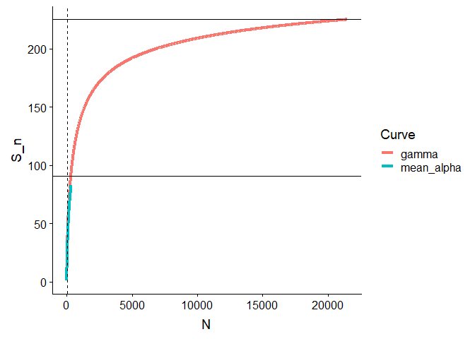

# betaC

The r package “betaC” provides code for the calculation of beta\_C, a
metric to quantify the non-random component in beta-diversity for a
given coverage.

## Installation

You can install the development version of betaC from
[GitHub](https://github.com/T-Engel/betaC) with:

``` r
devtools::install_github("T-Engel/betaC")
```

Please, also install the package “vegan” from CRAN.

## Example: Beta-diversity of the BCI dataset from vegan

Let’s look at the beta\_diversity of the BCI dataset that comes with the
package vegan.

``` r
library(betaC)
library(vegan)
#> Loading required package: permute
#> Loading required package: lattice
#> This is vegan 2.5-4
data(BCI)

# Multiplicative beta-diversity 
gamma=specnumber(colSums(BCI))
alpha= mean(specnumber(BCI))
beta_BCI=gamma/alpha
beta_BCI
#> [1] 2.478519

# beta_C for 50% coverage
beta_C_BCI<-beta_C(BCI,0.5)
beta_C_BCI
#> [1] 1.088571
```

The samples have a beta-diversity of 2.48 but most of this differention
is due to a sampling effect. If we standardize to the number if
individuals that corresponds to 50 % coverage at the gamma scale we find
that the partition of the non-random component in beta-diversity is only
ca 1.09

To illustrate this let’s have a look at the rarefaction curves

``` r
library(tidyverse)
#> -- Attaching packages ------------------------------------------------------------------------- tidyverse 1.2.1 --
#> v ggplot2 3.1.1       v purrr   0.3.2  
#> v tibble  2.1.1       v dplyr   0.8.0.1
#> v tidyr   0.8.3       v stringr 1.4.0  
#> v readr   1.3.1       v forcats 0.4.0
#> -- Conflicts ---------------------------------------------------------------------------- tidyverse_conflicts() --
#> x dplyr::filter() masks stats::filter()
#> x dplyr::lag()    masks stats::lag()

# calculate rarefaction curves
dat<-betaC:::rarefy_long(as.matrix(BCI))
#> Warning: Column `Curve` joining factors with different levels, coercing to
#> character vector
#> Warning: Column `type` joining character vector and factor, coercing into
#> character vector
#> Warning: Column `Curve` joining character vector and factor, coercing into
#> character vector
#> Warning: Column `type` joining character vector and factor, coercing into
#> character vector

# plot them
dat %>% filter(type== "major") %>% ggplot(aes(N,S_n, col= Curve))+ geom_line(size=1.5)+ geom_hline(yintercept =  alpha)+
geom_hline(yintercept =  gamma)+ geom_vline(xintercept =  invChat(colSums(BCI), 0.5), linetype= "dashed")
```



The horizontal black lines indicate the observed species richness at
alpha and gamma scales. The rarefaction curves fall very closely on top
of each other indicating that there is not a strong signal of spatial
structure. The observed beta-diversity is mostly caused by difference in
sample size. Beta\_C of 50% is calculated at a sample size of 40
individuals (dashed vertical line).
