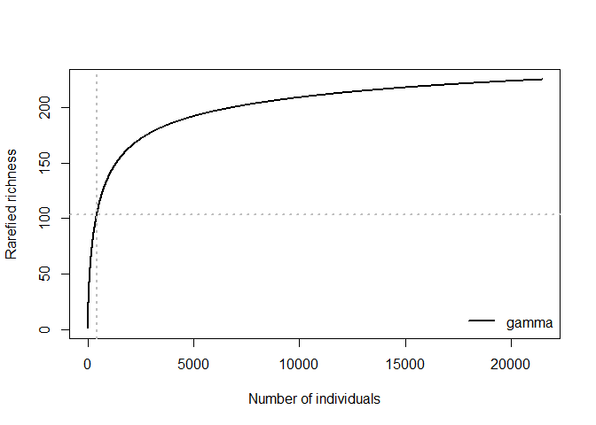

# betaC

The r package “betaC” provides code for the calculation of beta\_C, a
metric to quantify the non-random component in beta-diversity for a
given coverage.

## Installation

You can install the development version of betaC from
[GitHub](https://github.com/T-Engel/betaC) with:

``` r
devtools::install_github("T-Engel/betaC")
```

Please, also install the package “vegan” from CRAN. Furthermore,
“tidyverse” is recommended but the main functions will work without
it.

## Example: Beta-diversity of the BCI dataset from vegan

Let’s look at the beta\_diversity of the BCI dataset that comes with the
package vegan. First we calculate Whittaker’s multiplicative
beta-diverity and than we standardize it to a sample coverage of 50%
using `beta_C`.

``` r
library(betaC)
library(vegan)
#> Loading required package: permute
#> Loading required package: lattice
#> This is vegan 2.5-4
data(BCI)

# Multiplicative beta-diversity 
gamma=specnumber(colSums(BCI))
alpha= mean(specnumber(BCI))
beta_BCI=gamma/alpha
beta_BCI
#> [1] 2.478519

# beta_C for 50% coverage
beta_C_BCI<-beta_C(BCI,0.5)
beta_C_BCI
#> [1] 1.088571
```

The samples have a beta-diversity of 2.48 but most of this sample
differention is due to a sampling effect. If we standardize to the
number of individuals that corresponds to 50 % coverage at the gamma
scale we find that the partition of the non-random component in
beta-diversity is only ca. 1.09

To illustrate this let’s have a look at the two-scale rarefaction curve.

``` r
library(tidyverse)

# calculate rarefaction curves
dat<-betaC:::rarefy_long(as.matrix(BCI))

# plot them
dat %>% filter(type== "major") %>% ggplot(aes(N,S_n, col= Curve))+ geom_line(size=1)+ geom_hline(yintercept =  alpha)+
geom_hline(yintercept =  gamma)+ geom_vline(xintercept =  invChat(colSums(BCI), 0.5), linetype= "dashed")
```


The horizontal black lines indicate the observed species richness at
alpha and gamma scales. The rarefaction curves fall very closely on top
of each other indicating that there is not a strong signal of spatial
structure. The observed beta-diversity is mostly caused by difference in
sample size. Beta\_C of 50% is calculated at a sample size of 40
individuals (dashed vertical line).

For this example we chose the 50% arbitrarily. We can also examine the
entire scaling relationship of the nonrandom component in
beta-diversity. To do that we calculate beta\_Sn for every N and the
corresponding coverages at the gamma scale. This can be done using
`beta_C_curve`.

``` r
BCI_curve<-beta_C_curve(BCI)

head(BCI_curve)
#> # A tibble: 6 x 3
#>       N      C beta_Sn
#>   <int>  <dbl>   <dbl>
#> 1     1 0.0263    1.  
#> 2     2 0.0512    1.01
#> 3     3 0.0748    1.01
#> 4     4 0.0973    1.02
#> 5     5 0.119     1.02
#> 6     6 0.139     1.03
```

And here are the plots:

``` r

N_plot <-
    BCI_curve %>% ggplot(aes(N, beta_Sn)) + geom_line(size = 1) + geom_rug() +
    geom_hline(yintercept = beta_C_BCI,
               col = "red",
               linetype = "dotted") + geom_vline(
                   xintercept = invChat(colSums(BCI), 0.5),
                   col = "red",
                   linetype = "dotted"
               )
C_plot <-
    BCI_curve %>% ggplot(aes(C, beta_Sn)) + geom_line(size = 1) + geom_rug() +
    geom_hline(yintercept = beta_C_BCI,
               col = "red",
               linetype = "dotted") + geom_vline(
                   xintercept =  0.5,
                   col = "red",
                   linetype = "dotted"
               )
plot_grid(N_plot, C_plot, align = "v")
```



Note that both graphs show the same data on the y axis. The value
corresponding to 50% that we calculated previously is indicated by the
dotted red lines. The coverage/ sample size value used for the
standarisation stronly influences the value of beta\_C. Therefore it
should always be reported and compared with respect to the underlying
coverage.

## Functions

The main function `beta_C` uses the following helper functions to jump
between sample size and coverage. Both have been adapted from iNEXT.

  - `Chat`
  - `invChat`

Furthermore, there is a function that helps to determine the target
coverage value:

  - `C_target`
