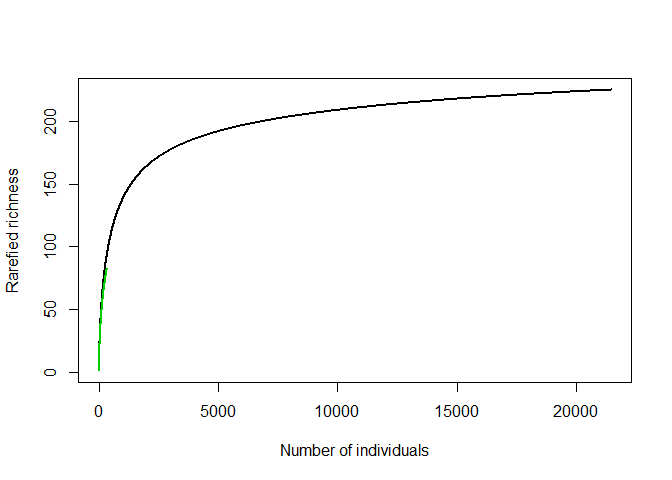

# About betaC

This r package “betaC” accompanies the following manuscript to be
submitted to *Methods in Ecology and Evolution*:

**Engel T., Blowes, S. A. McGlinn, D. J., May, F., Gotelli, N. J,
McGill, B. J., Chase, J. M. (2020). Resolving the species pool
dependence of beta-diversity using coverage-based rarefaction.**

The manuscript will also be made available on biorxiv shortly.

## Objectives

The r package and this repository have two main objectives:

1.  To provide easy tools for the calculation of beta\_C, a metric that
    quantifies the non-random component in beta-diversity for a given
    sample completeness.

2.  To to share the simulation code and results that we use in our
    above-mentioned paper. The data presented here will be archived upon
    acceptance of the manuscript.

## Installation

You can install the development version of the package “betaC” from
[GitHub](https://github.com/T-Engel/betaC) with:

``` r
devtools::install_github("T-Engel/betaC")
```

Please, also install the package “vegan” from CRAN.

``` r
install.packages("vegan")
```

Furthermore, “tidyverse” is recommended but the main functions will work
without it.

## Short walking tour of betaC

If you’ve read the paper and you just want to have the code to calculate
beta\_C, here is all you need to know:

  - The main function of this package is `beta_C(x, C)`. Its first
    argument `x` takes a site-by-species abundance matrix as a matrix
    object or data frame (sites=rows, species= rows). The second
    argument `C` is the target coverage used for standardization. The
    function returns beta\_C as a numeric value. Type `?beta_C` to see
    the documentation.

  - The other important function is `C_target(x)`. Its only argument `x`
    is a site-by-species abundance matrix. It returns the maximum
    possible coverage value that can be used to calculate beta\_C for
    the community matrix `x`. When comparing beta\_C across multiple
    communities with changing species pools, it is recommended to choose
    the `C` argument in `beta_C(x, C)`such that it corresponds to the
    smallest `C_target()` output of all the communities. Type
    `?C_target` to see the documentation.

If you’re unfamiliar with the method you might want to read the paper
and take the longer walking tour that follows below.

## Long walking tour of betaC

betaC is a beta-diversity index that measures intraspecific spatial
aggregation or species turnover in space independently of the size of
the regional species pool. This is important because most beta-diversity
metrics don’t only respond to the spatial structure of species diversity
in an area but also to the total number of species occuring there. So,
high beta-diversity can mean that there is a strong spatial clumping of
species and/or that there is just a high gamma diversity. People have
tried to disentangle these effects with mixed results.

In our paper we make the argument that the species-pool dependence of
beta-diversity is linked to two types of sampling effects. The first one
arises because alpha and gamma scale diversity estimates are usually
based on very different sample sizes (i.e., numbers of individuals
captured by a sample). This means that a major part of beta diversity is
usually due to a more-individuals effect and not due to spatial
structure. The second sampling effect concerns sample completeness and
its associated biases. Sample size is always relative. In small species
pools, relatively small sample sizes are sufficient to get a pretty good
sample, while in large species pools sample sizes have to be increased
dramatically to achieve the same degree of sample completeness
(e.g. capturing 80% of all the species in the area). We argue that
species pool dependence of beta-diversity is in fact the result of
changing sample completeness.

betaC controls for these sampling effects using a combination of
individual-based and coverage-based rarefaction. The main idea of our
approach is that within a species pool alpha and gamma scale diversity
estimates are standardized to a common number of individuals, while
across species pools we allow the sample size to vary in order to keep a
constant gamma-scale sample completeness instead, which is estimated
using sample coverage (*C*).

### Why to standardize alpha and gamma scale to the same sample size?

**Example 1: Beta-diversity of the BCI data set from vegan**

Let’s look at the beta\_diversity of the `BCI` data set that comes with
the package vegan. It’s a site by species abundance matrix with 50 plots
and 225 species from the Barro Colorado Island in Panama. If you want to
know more about the data set type `?BCI` after loading the the vegan
package. We are interested in the beta-diversity of the island because
it tells us something about the spatial structure of species diversity.
First, let’s calculate Whittaker’s multiplicative beta-diversity as


where
 is
the gamma species richness (i.e. all plots combined) and

is the alpha species richness (i.e. the average plot richness).

``` r
library(betaC)
library(vegan)
data(BCI)

# Whittakers multiplicative beta-diversity 
gamma=specnumber(colSums(BCI))
alpha= mean(specnumber(BCI))
beta_BCI=gamma/alpha
beta_BCI
#> [1] 2.478519
```

The samples have a beta-diversity of 2.48 The unit of this value is
“effective number of distinct sampling units”. This means that it
takes 2.48 hypothetical plots with complete species turnover to produce
the same beta-diversity that we observe in this data-set. Note that the
maximum possible value of beta is 50 here. In that case all 50 plots
would be completely unique in their species identities. The minimum
value of beta is 1 in which case all the plots share the same species.
However, this assumes that the sample size is big enough to randomly
sample all the species in the area - in other words that the samples are
complete. While this may be true on the gamma scale, where we have a
really large sample size, the alpha scale has a way smaller number of
individuals. Remember that the gamma scale has all the individuals of
the 50 subplots combined, while the average plot has only a 50th of this
sample size. Let’s have a look at this difference:

``` r
N_alpha= mean(rowSums(BCI))
N_gamma= sum(BCI)
barplot(c("gamma"=N_gamma,"alpha"= N_alpha), ylab = "Number of individuals", xlab = "Scale")
```


To control for this vast difference in sample size between the scales we
use a method called individual-based rarefaction (IBR). IBR lets you ask
the question “How many species can I expect to find if I sampled *n*
Individuals rather than the actual sample size of *N*?” This enables us
to rescale our gamma diversity estimate to the sample size observed at
the alpha scale. The relationship between this “rarefied richness” and
the sample size *n* is called a individual based rarefaction curve. The
r package `vegan` provides functions to carry out IBR. Let’s plot the
IBR curve for the gamma scale and see how the species richness changes
when we rarefy it down to the sample size of the alpha scale.

``` r
#gamma
gamma_curve= as.numeric(rarefy(colSums(BCI),sample = 1:N_gamma))

# plot
plot(gamma_curve, xlab = "Number of individuals", ylab= "Rarefied richness", type = "l", lwd=2)
abline(v = N_alpha, col="grey", lty=3, lwd=2)
abline(h = gamma_curve[N_alpha], col="grey", lty=3, lwd=2)
legend("bottomright", legend = "gamma", col = 1, lty = 1,lwd = 2,bty = "n")
```

 This
black curve is the gamma scale IBR curve. Typically, accumulation or
rarefaction curves have this non-linaner shape of a saturation curve.
The grey vertical line marks the alpha scale sample size and the
horizontal grey line is the rarefied richness of the gamma scale that
corresponds to this sample size. It looks like about half of the species
on the gamma scale have only been found because the gamma scale as way
more individuals than the alpha scale. Let’s look at the alpha scale to
see how it compares.

``` r
# alpha 
alphas_curves<-rarecurve(BCI)
```


These are all the alpha scale rarefaction curves. We are usually
interested in the average sample Therefore let’s take the mean of these
curves. Also, lets put them inthe in the same graph as the gamma scale
to see how they compare.

``` r
N_min= min(rowSums(BCI))
mean_alpha_curve= sapply(alphas_curves,function(x) return(as.numeric(x[1:N_min])) ) %>% rowMeans()


plot(gamma_curve, xlab = "Number of individuals", ylab= "Rarefied richness", type = "l", lwd=2)

lines(mean_alpha_curve, col =3, lwd=2)
```



Now, the green curve that we added is the mean alpha scale IBR. It sits
slightly below the gamma scale but most of the difference in species
richness between the to scales is really due to the more-individuals
effect. If the curves fall right on top of each other, species are
randomly distributed and if the alpha scale is below the gamma scale
this indicates intraspecific spatial aggregation. We quantify this
aggregation as the deviation between the two curves at a common number
of individuals (usually that is the smallest number of individuals found
at the alpha scale)

Like Whittaker’s beta we calculate an index of gamma over alpha.
However, here we use the rarefied richness estimates rather than the
observed species richness. The resulting index is called beta\_Sn. Let’s
calculate it with the function `beta_SN` provided by our package.

``` r
beta_Sn_BCI<-beta_SN(BCI, N_min)
beta_Sn_BCI
#> [1] 1.133941
#> attr(,"C")
#> [1] 0.8831
#> attr(,"N")
#> [1] 340
```

The value is larger than 1, which indicates the spatial aggregation that
we saw from looking at the IBR curves. However, it is much smaller than
the traditional beta-diversity that was inflated due to the
more-individuals effect. Instead of 2.48 times as many species, now the
gamma scale only has 1.13 times as many individuals as the alpha scale
when controlled for sample size. This is the true effect of spatial
aggregation.

### Why to standardize beta-diversity by coverage?

We saw that the deviation between alpha and gamma scale is due to
non-random spatial structure in diversity, however the magnitude of this
depends on how far out along the IBR curve it is calculated. It turns
out that the closer we get to the assymptote of the gamma scale IBR, the
bigger can be the gap between the curves.

``` r
beta_SN(BCI, 10)
#> [1] 1.039994
#> attr(,"C")
#> [1] 0.2109857
#> attr(,"N")
#> [1] 10
```

Now, the value is much smaller than the value that we calculated before,
although we are quantifying the deviation between the same pair of
curves.

This becomes relevant when we want to compare beta\_Sn among assemblages
with differently sized species pools. If the species pool is \#\#
Accessing the data of the manuscript

## Key references

  - Chase, J. M., McGill, B. J., McGlinn, D. J., May, F., Blowes, S. A.,
    Xiao, X., … & Gotelli, N. J. (2018). Embracing scale‐dependence to
    achieve a deeper understanding of biodiversity and its change across
    communities. Ecology letters, 21(11), 1737-1751.

  - Gotelli, N. J., & Colwell, R. K. (2001). Quantifying biodiversity:
    procedures and pitfalls in the measurement and comparison of species
    richness. Ecology letters, 4(4), 379-391.

  - McGlinn, D. J., Xiao, X., May, F., Gotelli, N. J., Engel, T.,
    Blowes, S. A., … & McGill, B. J. (2019). Measurement of Biodiversity
    (MoB): A method to separate the scale‐dependent effects of species
    abundance distribution, density, and aggregation on diversity
    change. Methods in Ecology and Evolution, 10(2), 258-269.

  - Kraft, N. J., Comita, L. S., Chase, J. M., Sanders, N. J., Swenson,
    N. G., Crist, T. O., … & Cornell, H. V. (2011). Disentangling the
    drivers of β diversity along latitudinal and elevational gradients.
    Science, 333(6050), 1755-1758.

<!-- badges: start -->

[](https://travis-ci.org/T-Engel/betaC)
<!-- badges: end -->
